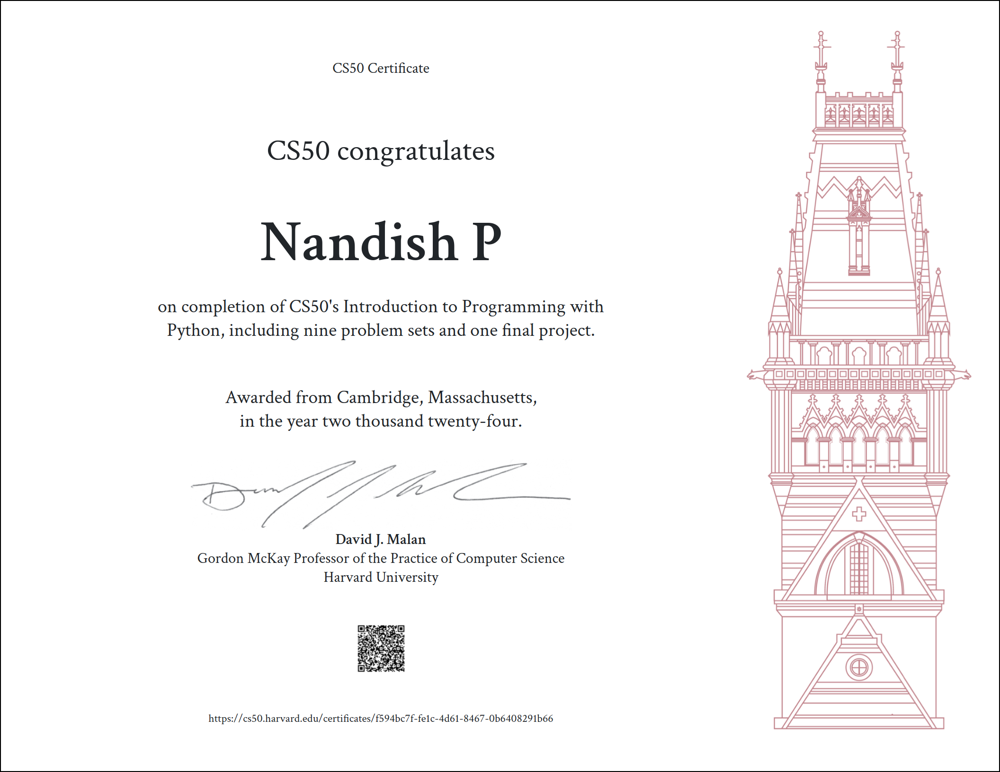

 

<h1 align="center"><a href="https://cs50.harvard.edu/python/2022/">
Harvard CS50’s Introduction to Programming with Python — CS50P 2022
</a></h1>

<pre align="center">
Certificate
</pre>

## Table of Contents
### [Week 0](./Week0/) - [Functions, Variables](https://cs50.harvard.edu/python/2022/weeks/0/)
- [Indoor Voice](./Week0/IndoorVoice)
- [Playback Speed](./Week0/PlaybackSpeed)
- [Making Faces](./Week0/MakingFaces)
- [Einstein](./Week0/Einstein)
- [Tip Calculator](./Week0/TipCalculator)

### [Week 1](./Week1/) - [Conditionals](https://cs50.harvard.edu/python/2022/weeks/1/)
- [Deep Thought](./Week1/DeepThought)
- [Home Federal Savings Bank](./Week1/HomeFederalSavingsBank)
- [File Extensions](./Week1/FileExtensions)
- [Math Interpreter](./Week1/MathInterpreter)
- [Meal Time](./Week1/MealTime)

### [Week 2](./Week2/) - [Loops](https://cs50.harvard.edu/python/2022/weeks/2/)
- [camelCase](./Week2/CamelCase)
- [Coke Machine](./Week2/CokeMachine)
- [Just setting up my twttr](./Week2/JustSettingUpMyTwttr)
- [Vanity Plates](./Week2/VanityPlates)
- [Nutrition Facts](./Week2/NutritionFacts)

### [Week 3](./Week3/) - [Exceptions](https://cs50.harvard.edu/python/2022/weeks/3/)
- [Fuel Gauge](./Week3/FuelGauge)
- [Felipe's Taqueria](./Week3/Felipe'sTaqueria)
- [Grocery List](./Week3/GroceryList)
- [Outdated](./Week3/Outdated)

### [Week 4](./Week4/) - [Libraries](https://cs50.harvard.edu/python/2022/weeks/4/)
- [Emojize](./Week4/Emojize)
- [Frank, Ian and Glen's Letters](./Week4/FrankAndGlen'sLetters)
- [Adieu, Adieu](./Week4/Adieu,Adieu)
- [Guessing Game](./Week4/GuessingGame)
- [Little Professor](./Week4/LittleProfessor)
- [Bitcoin Price Index](./Week4/BitcoinPriceIndex)

### [Week 5](./Week5/) - [Unit Tests](https://cs50.harvard.edu/python/2022/weeks/5/)
- [Testing my twttr](./Week5/TestingMyTwittr)
- [Back to the Bank](./Week5/BackToTheBank)
- [Re-requesting a Vanity Plate](./Week5/Re-requestingAVanityPlate)
- [Refueling](./Week5/Refueling)

### [Week 6](./Week6/) - [File I/O](https://cs50.harvard.edu/python/2022/weeks/6/)
- [Lines of Code](./Week6/LinesOfCode)
- [Pizza Py](./Week6/PizzaPy)
- [Scourgify](./Week6/Scourgify)
- [CS50 P-Shirt](./Week6/CS50P-Shirt)

### [Week 7](./Week7/) - [Regular Expressions](https://cs50.harvard.edu/python/2022/weeks/7/)
- [NUMB3RS](./Week7/NUMB3RS)
- [Watch on YouTube](./Week7/WatchOnYouTube)
- [Working 9 to 5](./Week7/Working9to5)
- [Regular, um, Expressions](./Week7/RegularUmExpressions)
- [Response Validation](./Week7/ResponseValidation)

### [Week 8](./Week8/) - [Object-Oriented Programming](https://cs50.harvard.edu/python/2022/weeks/8)
- [Seasons of Love](./Week8/SeasonsOfLove)
- [Cookie Jar](./Week8/CookieJar)
- [CS50 Shirtificate](./Week8/CS50Shirtificate)

### [Final Project](./project/) - [Final Project Link](https://cs50.harvard.edu/python/2022/project/)
- [Final Project](./project/)