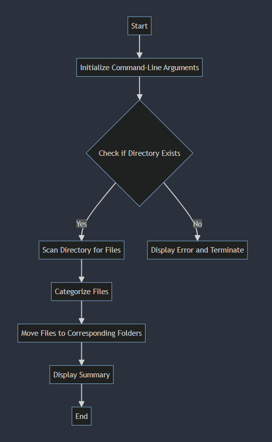

# File Organizer Tool

## Video

<video src='https://youtu.be/o5sqteQ5rrY' width=180></video>

* Find it on [Youtube](https://youtu.be/o5sqteQ5rrY)

## Overview

Have you ever had a messy directory that you always wanted to organize but never got time to? For many Windows users, this would be their default download directory, where you download all kinds of stuff and then never organize it. The File Organizer Tool is a Python script designed to automatically organize files in a specified directory based on their file types. This project aims to simplify file management by categorizing files into different folders like Images, Documents, Videos, and Others.

## Project Details

### Author
- **Name:** [Your Name]
- **GitHub Username:** career-nandish
- **edX Username:** career_nandish
- **CS50 Page:** https://cs50.harvard.edu/python/2022/project/

## Features

- **Automatic Organization:** Automatically organizes files into categorized folders.
- **Customizable Directories:** Specify custom directories for saving organized files.
- **Summary Report:** Provides a summary report of the number of files moved to each category.

## Project Structure

<pre>
project/
│
├── project.py # Main script
├── test_project.py # Test script
├── README.md # Project documentation
├── requirements.txt # List of dependencies
└── test_directory/ # Directory for testing purposes
</pre>

## Usage

### Prerequisites

- Python 3.x
- Required packages listed in `requirements.txt`

### Installation

1. Clone the repository:

```bash
git clone https://github.com/[YourGitHubUsername]/project.git
cd project
```

2. Install the required dependencies:

```bash
pip install -r requirements.txt
```
### Running the Script

To run the script, use the following command:

```bash
python project.py -d DIRECTORY_PATH
```

Replace DIRECTORY_PATH with the path of the directory you want to organize.

### Command-Line Arguments
* --directory or -d: The directory to organize (required).

#### Example
```bash
python project.py --directory "C:\Users\YourUsername\Downloads"
```

### Testing

To run the tests, use the following command:

```bash
pytest test_project.py
```

### Functions in project.py

The tool works by scanning the specified directory and moving files into subdirectories based on their extensions. For example, .jpg and .png files go into the 'Images' folder, .pdf and .txt files go into the 'Documents' folder, and so on. If a file type isn't specified, it goes into the 'Others' folder.


1. `main()`

Parses command-line arguments and initiates the file organization process.

2. `organize_files(directory: str) -> None`

Organizes files in the specified directory into categorized folders.

3. `take_arguments() -> Namespace`

Returns the category of the file based on its extension.

4. `exists_check(directory:str) -> bool`

return True if directory exists else False.

### Functions in test_project.py

I've also implemented several test cases to ensure the tool works as expected. These tests cover scenarios like organizing an empty directory, handling non-existent directories, and ensuring only specified file types are moved. Running these tests with pytest ensures the reliability and robustness of the tool.


1. `setup_module()`

Sets up the testing environment by creating a temporary directory and adding test files.

2. `teardown_module()`

Cleans up the testing environment by removing the temporary directory and its contents.

3. `test_organize_files()`

Tests the organize_files function to ensure files are correctly moved to respective folders.

4. `test_non_existent_directory()`

Tests the behavior when a non-existent directory is provided.

5. `test_empty_directory()`

Tests the behavior when an empty directory is provided.

## Flowchart

<p>
	
</p>

## Support

If you find this project helpful, please consider giving it a ⭐️!